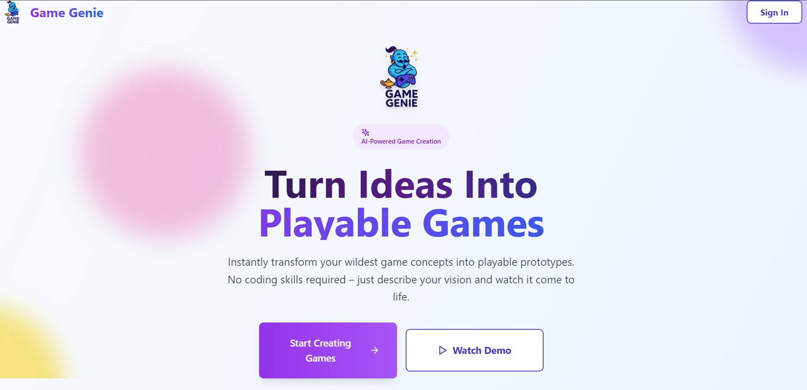
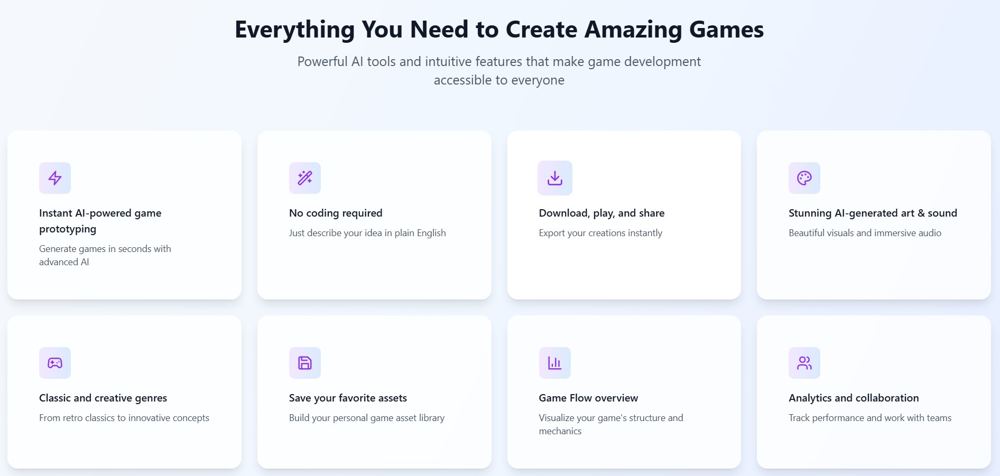

# 🎮 Game Genie

**Game Genie** is an AI-powered rapid game prototyping platform that transforms your game ideas into fully playable prototypes within minutes. Whether you're a seasoned developer or a first-time creator, Game Genie helps you design, generate, and share games effortlessly using cutting-edge AI and a modern, user-friendly interface.

---

### 🖼️ Screenshots

## 🚀 Features

### 🧠 AI Game Prototyping
Generate complete game prototypes from simple text prompts. Game Genie handles the code, assets, and configuration automatically.

### 🎨 AI Asset Generator
Create custom images, sound effects, and music using advanced AI models like OpenAI and Freesound.

### 🌍 Procedural Content Generation
Automatically generate infinite levels, maps, and other game content through AI-powered procedural algorithms.

### 🗨️ AI NPC Dialogue
Produce lifelike, multi-turn conversations for game characters with a built-in chat-style dialogue generator.

### 💡 Code Assistant
Receive real-time, AI-enhanced code analysis and improvement suggestions tailored to your game projects.

### 📊 Built-in Analytics
Track user engagement, session durations, and game completion rates with integrated analytics tools.

### ♿ Accessibility Checker
Ensure your game is accessible to all players with a tool that identifies and suggests fixes for accessibility issues.

### 🤝 Real-Time Collaboration
Collaborate with teammates in real time. Invite others to co-create and iterate on your game projects together.

### 📦 Export & Share
Package and download your game with one click — ready to distribute, deploy, or showcase.

### 🕹️ Sample Games
Browse a curated collection of sample games for inspiration, learning, and exploration.

### 📁 Personal Asset Library
Save and organize your favorite AI-generated assets in the "My Assets" section for future use.

### ✨ Modern UI/UX
Enjoy a clean, responsive, and intuitive interface with feature-rich modals and a full-width landing experience.

---

## 👥 Made with ❤️ by Team Game Genie
